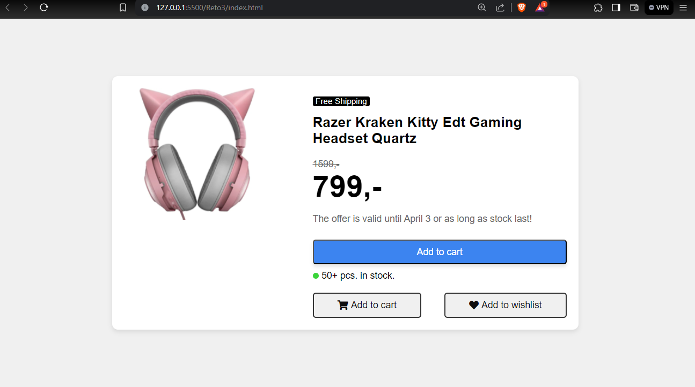

# 100daysofprojects

## Descripción

Product Info construido con HTML, CSS, para mejorar nuestras habilidades de codificación. Este proyecto es parte del desafío #100daysofprojects promovido por Frontend Club.

## Capturas




## Tabla de contenidos


1. [El desafío](#El-desafío)
2. [Flujo de trabajo](#Flujo-de-trabajo)
3. [Desarrollo](#Desarrollo)
4. [Contacto](#Contacto)

## El desafío

Codificar una tarjeta de perfil personal, usando HTML, CSS y JavaScript, y lograr que se parezca lo más posible al diseño.

Los usuarios deberían poder:

- Ver el diseño óptimo en pantallas grandes (1200px).
- Ver un color diferente (hover) al pasar el mouse sobre el botón principal.
- Ver un color diferente (hover) al pasar el mouse sobre los botones secundarios.
- Ver un color de sombra (box-shadow) como se muestra en la imagen.

## Flujo de trabajo

### Desarrollo

Estructura del proyecto:

```
/
📂
├── 📂css/
│   ├── normalize.css
│   └── styles.css
├── 📂images/
    ├── favicon-32x32.png
│   └── headphone.png
└── index.html
└── README.md
```

Tecnologías:

- HTML Semántico
- Estilos CSS
- Animaciones CSS
- Metodología BEM
- Responsively App

Flujo de desarrollo:

1. Análisis del diseño
2. Configuración inicial
3. Instalación de módulos y dependencias
4. Vinculación de archivos y librerías
5. Inicio del proyecto con Git
6. Marcado HTML
7. Etiquetas meta
8. Estilos CSS
9. Recursos

### Fragmentos de código

```html
<meta charset="UTF-8">
<meta name="author" content="Kassis">
<meta name="title" content="Product info">
<link rel="stylesheet" href="css/normalize.css">
<link rel="stylesheet" href="css/styles.css">
<link rel="shortcut icon" href="./images/favicon-32x32.png" type="image/x-icon">
<link rel="icon" href="favicon.ico" type="image/x-icon">
```

```css
body {
  margin: 0;
  padding: 0;
  display: flex;
  justify-content: center;
  align-items: center;
  height: 100vh;
  background-color: #f0f0f0;
  font-family: 'Montserrat', sans-serif;
}

.container {
  display: flex;
  flex-wrap: wrap;
  align-items: flex-start;
  justify-content: center;
  max-width: 750px;
  background-color: #fff;
  padding: 20px;
  border-radius: 10px;
  box-shadow: 0 4px 8px rgba(0, 0, 0, 0.1);
}

.cart-btn {
  /* Estilos del botón Add to cart */
}

.buy-btn {
  /* Estilos del botón Add to cart */
}

.wishlist-btn {
  /* Estilos del botón Add to wishlist */
}

.stock-info {
  /* Estilos de la información de stock */
}

.dot {
  /* Estilos del punto de stock */
}

.stock-label {
  /* Estilos de la etiqueta de stock */
}
```


## Contacto

- [GitHub](#https://github.com/Kassi29)
- Correo: [kassbd29@gmail.com](kassbd29@gmail.com)
```

Este README resalta los puntos clave del proyecto.